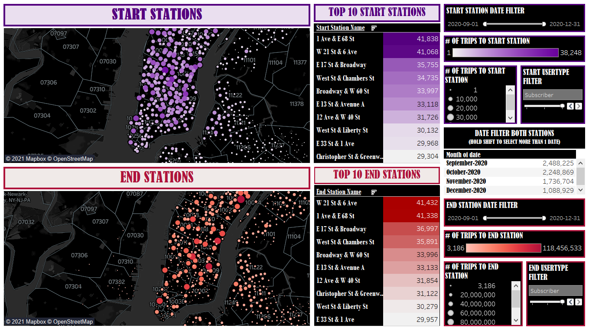
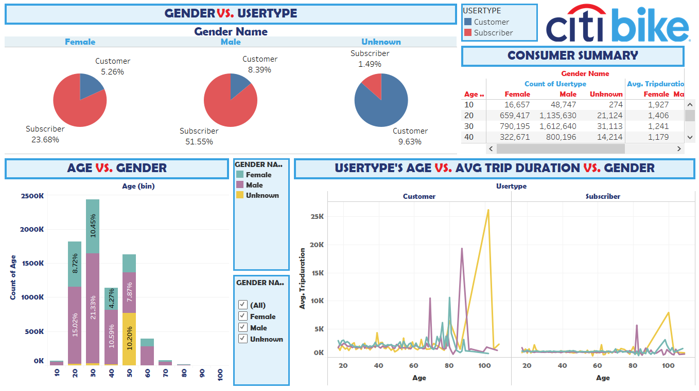

# Citi Bike Analysis
Deploy Dashboard: https://public.tableau.com/profile/rebecca.pham1065#!/vizhome/Citi-Bike-Dashboard/Dashboard1-StationsMap

This analysis will examine data from Citi Bike NYC and display it in 2 interactive dashboards. Python was used to aggregate the monthly datasets from the company then transform or drop columns to help with the analysis. After transformation, the final data frame was loaded to a csv file and pulled into Tableau. Below you will find a description of each dashboard and any insights pulled from the data visualizations.

## Dashboard 1-Stations Map

The first dashboard marks the location of the start and end stations maps with stations markers where color and size demonstrate popularity of station. The theme of the dashboard was to be a dark mode. These two maps included in other tiles like the Top 10 Station table for both the start and end station that can be used to filter the map. Other filters included are individual date filter for start and end station and a date filter for both stations. 

For the two maps, if you filter between customer and subscriber, for subscribers the south stations of NY are more popular while for regular customers the north stations (around Manhattan) are more popular for both the start and end station. Another observation is the start and end station have similar station popularity as we look at the top 10 stations for both start and end. They both have the same stations name included in their top 10. This information can mean that you want to include more bikes at these stations due to popularity. The last observation is if you look at end stations in New Jersey (ZIP 07302) there are markers there but none in the start station. Due to many people returning bikes here and not taking bikes from these locations to start their trip, these stations could have more bikes than necessary, and we may want to consider a solution to prevent overcrowding whether it be manually reallocating those bikes to other stations.

## Dashboard 2-Customer

The second dashboard will display and give insight on the business’s customer demographic. The dashboard will display various customer information such as age, gender, and user type against total users and average trip duration. The theme of the dashboard was to use similar colors from the Citi Bike’s logo. 

The pie graph demonstrates the percentage of customers and subscribers spilt against the gender category. From observation you can see a large ratio of customers put their genders as unknow. There is a possibility for most customers they do not bother filling out their gender since it's not required to use Citi Bikes. If the company is looking to get more information from the customer population, they can make gender options mandatory or add more gender options. Another observation from the pie graph and the bar graph is that there is a larger ratio of man using Citi Bikes compared to females. From the bar graph, you can observe that a large ratio of bin range 50 is unknown, this could possibly be due to the age being a default setting. Another strange observation is the average trip duration gets significantly higher from ages around 100, this most likely is an anomaly and we can consider disregarding those ages as there are not many total trip in those age bins if we take a look at the consumer summary.
